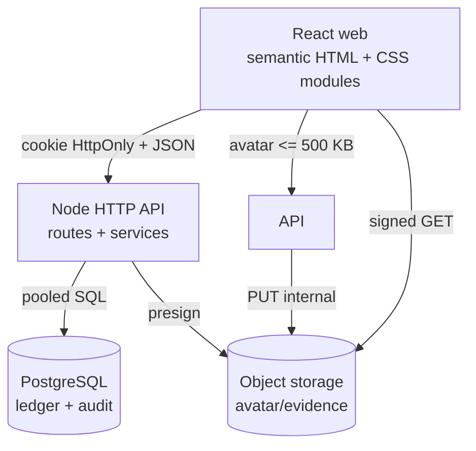
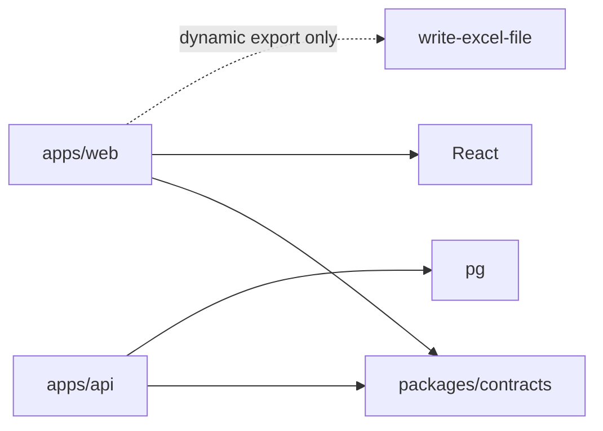

# Arsitektur sistem

## Tujuan dan batas sistem

Putra Laskar Indonesia Dashboard adalah aplikasi operasional multi-cabang untuk master produk/unit/pompa, ledger stock, bacaan meter, alokasi FIFO, rekonsiliasi, laporan, profil, pengumuman, dan audit. Frontend adalah React web semantik; backend memakai Node.js native HTTP dan PostgreSQL. File pengguna tidak disimpan pada filesystem runtime, melainkan di object storage melalui URL bertanda tangan.

## Workspace dan arah dependensi

`packages/contracts` tidak bergantung pada UI atau database. Domain FIFO dan formula murni dapat diuji tanpa server. Dependensi hanya bergerak dari entrypoint menuju detail infrastruktur; tidak ada import dari API ke web atau sebaliknya.

## Pola perangkat lunak

| Pola | Lokasi | Tujuan |
|---|---|---|
| Modular monorepo | `apps/*`, `packages/*` | Kontrak bersama tanpa menduplikasi DTO/formula |
| Context + gateway | `apps/web/src/app`, `data` | Memisahkan state sesi/cabang/preferensi dari transport HTTP |
| Small components | `components` | Dialog, panel, hint, chart, dan feedback dapat digunakan ulang |
| Native router | `apps/api/src/http/router.ts` | Routing kecil tanpa framework server tambahan |
| Transaction script | route operasional | Satu command bisnis berada dalam satu transaksi PostgreSQL |
| Repository/service | dashboard | Query baca kompleks terpisah dari perakitan response |
| Pure domain | `domain/fifo.ts`, contracts formula | Algoritma dapat diuji deterministik |
| Idempotent command | mutasi/meter | Retry jaringan tidak menggandakan transaksi |
| Immutable event history | audit/revision/comment | Perubahan dapat ditelusuri dan trigger menolak edit/hapus |
| CQRS ringan | write tables + read views | Command menulis ledger; dashboard membaca view/aggregate |
| Direct-to-object-storage | upload presign | Function tidak menampung byte file dan tidak memerlukan filesystem persisten |
| Client provenance policy | API boundary | Web allowlist dan credential native dapat dikonfigurasi tanpa mengubah route bisnis |

## Alur request

1. Browser memanggil gateway dengan `credentials: include`.
2. Router mencocokkan method/path dan membuat request ID.
3. Middleware memvalidasi provenance client; route kemudian memeriksa sesi, role, branch scope, dan origin mutation sebagai defense-in-depth.
4. Validator mengembalikan `AppError` terstruktur untuk input tidak valid.
5. Route menjalankan transaksi; command stock mengunci unit/layer dengan `FOR UPDATE`.
6. Audit sukses ditulis dalam transaksi yang sama. Error terklasifikasi dicatat sebagai `FAILED` atau `DENIED` tanpa mengekspos detail internal ke pengguna.
7. Response memakai JSON konsisten, `cache-control: no-store`, dan `x-request-id`.

## Konsistensi dan konkurensi

- Posting bacaan, konsumsi FIFO, mutasi `SALE`, allocation, dan audit di-commit atomik.
- Layer dibaca dalam urutan `received_at, sequence_no, id` dan dikunci sebelum `remaining_qty` dikurangi.
- Transfer mengunci kedua unit dalam urutan UUID agar mengurangi risiko deadlock.
- `idempotency_key` unik per cabang mengubah retry menjadi replay aman.
- Koreksi rekonsiliasi menyimpan snapshot before/after dan alasan; revisi historis tidak ditimpa.

## Realtime

Dashboard dan pengumuman memakai polling 10 detik; log aktivitas 15 detik. Ini sengaja dipilih agar tidak menambah broker/WebSocket dependency dan tetap kompatibel dengan serverless. Tab yang aktif menghentikan request lama menggunakan `AbortController`. Jika skala polling menjadi mahal, evolusi yang disarankan adalah PostgreSQL outbox + managed pub/sub/SSE, tanpa mengubah kontrak command.

## Frontend

- Hash routing menjaga deployment static sederhana dan tidak memerlukan router library.
- Semua stylesheet berada di file CSS terpisah; tidak ada CSS framework atau style object untuk layout normal.
- Gruvbox adalah default; Catppuccin Mocha dan Hatsune Miku tersedia sebagai preferensi lokal.
- Deskripsi sekunder disimpan pada tooltip/focus hint agar antarmuka tidak padat.
- Tirai pengumuman dapat disembunyikan, menampilkan maksimum tiga baris dalam viewport, dan menggulir pengumuman aktif beserta waktu publikasi.
- Menu Kelola Akun hanya dirender untuk admin; API tetap menegakkan role secara independen.
- Grafik SVG memakai skala stock dan penjualan terpisah, dengan rentang 7/14/30/60/90 hari.
- Tutorial mengarahkan pengguna pada kontrol nyata; area di luar target hanya diredupkan ringan.

## Deployment topology

| Lingkungan | Web | API | Database | Object storage |
|---|---|---|---|---|
| Local Compose | Node static server Alpine | Node HTTP Alpine | PostgreSQL Alpine | SeaweedFS mini |
| Vercel | Vite static CDN | `api/[...path].mjs` Node Function dari API terkompilasi | PostgreSQL eksternal pooled | S3-compatible eksternal |

Production tidak menjalankan seed. Migration dan bootstrap admin adalah pekerjaan administratif terpisah dari request Function.
