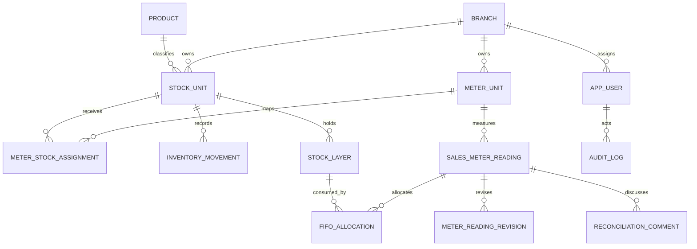

# Model data PostgreSQL

Schema menggunakan UUID untuk entitas bisnis, `numeric(18,3)` untuk liter, `numeric(18,2)` untuk uang, `timestamptz` untuk event, dan `date` untuk tanggal bisnis. Migration bersifat append-only dan dilacak dalam `schema_migration`.

## Relasi utama

## Kamus tabel

| Tabel | Peran | Kunci/relasi penting | Retensi/invarian |
|---|---|---|---|
| `branch` | Cabang operasional | `code` unik | Soft-active; timezone per cabang |
| `product` | Produk global | `code` unik | Dibuat admin; unit default `LITER` |
| `stock_unit` | Lokasi/sumber stock dinamis | branch + product; `(branch_id, code)` unik | Kapasitas > 0, threshold ≥ 0 |
| `meter_unit` | Pompa/meter dinamis | branch; `(branch_id, code)` unik | Nonaktif tidak menghapus histori |
| `meter_stock_assignment` | Mapping meter → stock bertanggal | meter + stock | `valid_to >= valid_from`; exclusion constraint menolak rentang tumpang tindih |
| `reporting_group` | Kelompok laporan | branch; code unik per cabang | Tidak boleh menjadi target transaksi |
| `reporting_group_member` | Anggota kelompok bertanggal | group + stock | PK mencakup `valid_from` |
| `price_rule` | Aturan markup historis | branch + product | Rentang berlaku tidak boleh tumpang tindih; rounding > 0 |
| `inventory_movement` | Ledger kuantitas append-only secara bisnis | branch + stock; idempotency unik per branch | Delta tidak boleh 0; status posting |
| `stock_layer` | Persediaan FIFO | stock, waktu, sequence | initial > 0; remaining ≥ 0; selling ≥ cost |
| `sales_meter_reading` | Bacaan meter dan setoran | meter + tanggal + shift unik | Quantity generated; idempotent; continuity di service |
| `fifo_allocation` | Penghubung sale ke layer | reading + layer unik | quantity > 0; snapshot cost/selling |
| `stock_opname` | Hasil hitung fisik | stock + tanggal unik | variance generated |
| `adjustment_suggestion` | Usulan/keputusan opname | satu per opname | Menyimpan keputusan dan alasan |
| `expense` | Beban cabang | branch + tanggal | amount > 0 |
| `other_income` | Pendapatan lain | branch + tanggal | amount > 0 |
| `app_user` | Akun aplikasi | email dan employee ID unik | Soft-delete; role enum; avatar metadata |
| `user_session` | Sesi opaque | hash token unik | Expiry, last seen, revocation |
| `auth_rate_limit` | Bucket rate limit | `bucket_key` | Window + attempt count |
| `system_broadcast` | Pengumuman | optional branch + creator | Window start/end dan severity |
| `audit_log` | Event aktivitas | actor/branch opsional | Trigger menolak update/delete |
| `meter_reading_revision` | Snapshot koreksi | reading + revision unik | Trigger immutable; alasan dan actor wajib |
| `reconciliation_comment` | Diskusi tree | reading, parent, author | Trigger immutable; parent tidak boleh diri sendiri |

Tabel teknis `schema_migration` dan `schema_seed` menyimpan nama serta checksum SHA-256 file SQL yang sudah diterapkan. Runner memakai advisory lock, dapat dijalankan ulang, dan menolak file lama yang berubah. Jangan menghapus barisnya secara manual.

Migration hardening juga memasang composite foreign key agar movement/stock, reading/meter, dan parent comment selalu berada pada cabang/transaksi yang sama. Exclusion constraint menolak assignment meter serta price rule dengan rentang tanggal tumpang tindih sebelum data ambigu dapat tersimpan.

## Enum

| Enum | Nilai |
|---|---|
| `posting_status` | `DRAFT`, `POSTED`, `CANCELLED`, `REVERSED` |
| `reconciliation_status` | `PENDING`, `MATCHED`, `EXPLAINED`, `ESCALATED`, `CLOSED` |
| `inventory_movement_type` | `OPENING`, `SUPPLY`, `SALE`, `SALES_RETURN`, `SUPPLIER_RETURN`, `TRANSFER_IN`, `TRANSFER_OUT`, `GAIN`, `LOSS`, `REVERSAL` |
| `user_role` | `ADMIN`, `MANAGER`, `OPERATOR`, `FINANCE`, `AUDITOR` |
| `broadcast_severity` | `INFO`, `WARNING`, `CRITICAL` |

## View baca

### `daily_stock_view`

Mengagregasi movement berstatus `POSTED` per unit/tanggal. Saldo akhir adalah running sum semua delta; saldo awal harian adalah saldo sebelum mutasi hari itu. `OPENING` diperlakukan sebagai input saldo awal pertama, bukan supply.

$$
closing = opening + supply + return + transferIn + gain - sales - transferOut - loss
$$

Jika suatu tanggal tidak memiliki movement, repository dashboard mengambil closing terakhir sebelum tanggal tersebut. Trend menghitung running stock langsung dari ledger sehingga hari tanpa movement tetap membawa saldo terakhir.

### `meter_reconciliation_view`

Menggabungkan bacaan, mapping meter-stock efektif, allocation FIFO, dan setoran. Nilai utama:

$$
meterSales = meterEnd - meterStart + resetOffset
$$

$$
literVariance = postedSales - meterSales
$$

$$
cashVariance = deposit - expectedSales
$$

## Indeks penting

| Indeks | Query yang dibantu |
|---|---|
| `inventory_movement_stock_date_idx` | Ledger/saldo unit menurut tanggal |
| `inventory_movement_branch_date_posted_idx` | Tren branch tanpa scan berulang per hari |
| `stock_layer_active_fifo_idx` | Layer FIFO aktif dalam urutan penerimaan |
| `sales_meter_reading_branch_date_idx` | Dashboard/rekonsiliasi harian |
| `audit_log_branch_time_idx` | Activity branch terbaru |
| `audit_log_actor_time_idx` | Profil aktivitas pengguna |
| `audit_log_object_time_idx` | Histori per object |
| `audit_log_outcome_time_idx` | Filter success/failure/denied |
| `audit_log_search_trgm_idx` | Pencarian object, alasan, dan metadata audit |
| `meter_reading_revision_reading_idx` | Revisi transaksi |
| `reconciliation_comment_reading_idx` | Thread komentar |

## Invarian transaksi FIFO

1. Unit stock harus aktif dan berada di branch yang diizinkan.
2. Mutasi masuk memerlukan cost dan selling price; selling tidak boleh di bawah cost.
3. Sale/return supplier/transfer keluar mengunci layer aktif dan menolak jika quantity kurang.
4. Allocation menyimpan snapshot harga, sehingga laporan historis tidak berubah ketika master harga berubah.
5. Bacaan, allocation, stock sale, status rekonsiliasi, dan audit sukses berada dalam satu transaksi.
6. Retry dengan idempotency key yang sama memakai advisory transaction lock per key, lalu mengembalikan record lama; transaksi dengan key berbeda tetap berjalan paralel.

## Migration

- Tambahkan file baru `database/migrations/NNN_deskripsi.sql`; jangan mengubah file yang pernah production-applied.
- Gunakan DDL backward-compatible lebih dahulu, deploy kode yang memahami kedua bentuk, backfill, lalu hapus bentuk lama pada release berikutnya.
- Uji migration pada salinan backup dan jalankan `npm run db:migrate` satu kali dari job administratif tepercaya.
- Function request tidak menjalankan migration.
